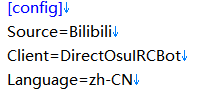
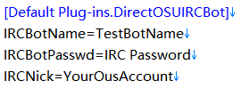

# Sync使用指南

## 使用之前
> - **确认你拥有支持你的游戏的Client插件**
> - **确认你拥有支持你所在直播平台的Source插件**
> - Client 负责与游戏通讯，向游戏发送、转发来自弹幕的消息
> - Source 则是负责直播间弹幕的通讯，获得直播间的弹幕或者评论，并向Client发送这些消息

## 官方插件说明

### **DefaultPlugin**
> **官方默认附带的插件**
>
> 内含基本常用命令，Bilibili、Twitch、Douyutv的弹幕源，游戏OSU的Client。以及一些基本常用的消息过滤器等。

### **DefaultGUI**
> **官方推荐的GUI插件**
>
> 程序本身是CLI界面的，这个插件提供了GUI操作程序的机能，但是这个插件是根据DefaultPlugin插件里的设置优化的，可能会不兼容其他的插件
>
>前置要求: DefaultPlugin

### **NowPlaying**
> **osu!游戏直播间!np命令支持**
>
> 该插件支持在直播间发送弹幕或评论 '?np'时，查询osu!正在播放的曲目，并向直播间反馈消息(需要直播源支持)
>
>前置要求: DefaultPlugin

### **PPQuery**
> **osu!游戏时PP查询**
>
> 该插件让默认的Client支持在游戏中对Bot(游戏IRC机器人)发送/np指令时，向osu!的PP查询机器人tillerino发送查询PP的消息并将结果反馈给设置的目标IRC账号。
>
>前置要求: DefaultPlugin

## 常用指令说明
插件DefaultPlugin提供了一系列指令可供使用，下面列举几条常用指令

> ### 1. start/stop/restart/exit 指令
>
> 当配置好直播源与Client之后，输入**start**命令即可传达指示“可以开始工作了”，直播源和Client随即开始工作，当需要停止时，输入**stop**即可下达“请停止工作"的指示。
> - **restart**指令可让程序立即重新启动
> - **exit**指令可以让程序直接退出
>
> -----------------
> ### 2. sources/filters/client/listlang/lang/status 指令
>
> 这些指令为信息查询指令
> - **source** 指令可以查询支持的source列表
> - **filters** 指令可以查询当前工作的filter列表
> - **client** 指令可以查询client列表和设置当前工作的client
> - **listlang** 指令可以查询当前支持的语言
> - **lang** 指令可以设置当前语言
> - **status** 指令可以查询当前的工作状态
>
> -----------------
> ### 3. sourcemsg/clientmsg/setbili/setosubot/sourcelogin 指令
>
> 这些是用于直播源和Client的指令
> - **sourcemsg**是给直播源发送消息的测试指令(需要直播源支持)
> - **clientmsg**是给Client发送消息的测试指令
> - **setbili**是设置Bilibili直播间的房间号的指令
> - **setosubot**是设置DirectOSUIRCBot这个Client的机器人(Bot)IRC账号密码以及目标IRC的账号密码的指令
> - **sourcelogin**指令可以向Source发送登录指令，让Source尝试支持发送机能
>
> ### **注：上述命令需要DefaultPlugin插件支持**

## 配置文件
整个程序以及插件的配置文件写入在程序同目录下的**config.ini**文件中，用户可以随时更改，更改需要重启程序才能生效。

配置文件是标准的INI文件结构形式，单个Key-Value支持最大2KB的存储。

### 1.配置节

>
> 配置文件由配置节、以及配置节下的系列键值对组成
> 程序本身的配置节为[config]节，支持的配置项如下
>
> - **Source** 设置直播弹幕源
> - **Client** 设置初始化时使用的Client
> - **Language** 设置程序运行时使用的语言
>
> 如图所示
>
> 

#### OSUIRCBot(用于osu!的机器人)的配置节配置步骤
> 1. 找到 **Default Plug-ins.DirectOSUIRCBot**
> 
> 2. 获取小号的IRC密码   在osu官网登录你小号的账号，然后在首页进入[IRC页面](https://osu.ppy.sh/p/irc)获取IRC密码(Server Password)。
>
> 3. 使用配置文件配置Client或使用命令设置
>   **IRCNick** : 要接收信息的大号,也就是你要正在玩的大号，直播源发来的信息将会发送到这个账号上
>   **IRCBotName** : 中间人小号，用于收发信息，直播间发来的信息通过这个小号代发送到IRCNick这个IRC账号
>   **IRCBotPasswd** : 小号的IRC密码
>
> 4. 使用命令配置Client
>    命令**setbotirc** (IRCBotName) (IRCBotPasswd) (IRCNick)
>     参数为必填参数
>
> 如图所示
>
> 

#### BiliBili直播源的配置节配置步骤
> 1. 找到 **Default Plug-ins.BiliBili**
>
> 2. 设置 **RoomID** 为你的直播间ID
>
> 3. 设置 **Cookies** 为你B站账号的Cookie
>
> 4. 上述两项可以自己手动设置，也可以在程序中使用指令完成
> 5. 使用指令即为
>   
>    **setbili** (RoomID) 指令可以直接设置Bilibili直播间的ID
>
>    **sourcelogin** [用户名] [密码] 指令可以直接打开B站登录页面，用户名和密码是选填项。执行指令后会自动弹出一个登录页面，在页面上登录即可自动保存你的登录Cookie。
>    
>    如果不放心程序的登陆程序，您可以自己在网页上登录
> 
> 提取cookie.拿BILIBILI来举例，你可以在你的浏览器(chrome内核)打开B站直播首页(在你登录的前提下)。按F12打开控制台(Console).输入`doucument.cookie`并回车，将出现的红色内容复制，打开config.ini，在Default Plug-ins.BiliBili找到并填写为`Cookies=红色内容`
>
> 
>

## 启用Sync
如果已经配置好了，那么请在程序输入`start`指令.

如果成功的话你可以发现你的小号已经登录在IRC了

这时候你可以测试是否流通了(其实不用

默认情况下，自己发送的消息会回流到irc，如刚才情况。如果想要禁止回流的话请在IRC里面输入`ban (你直播间ID名)`

## 关闭Sync
在程序输入`stop`即可停止工作，输入`exit`即为停止工作后退出程序

## 关于以及声明
1.	本程序本质是一个消息收发程序，其对OSU频道的收发均是通过IRC协议编写轮子使用。对于直播间也是通过模拟环境以及Client接受直播间弹幕信息。所以本软件并非是非法软件(

2.	本程序支持插件使用，并留有插件的接口。如果可以，你可以自己编写一个插件来给本程序添加额外功能，通常程序启动时候会自动加载程序根目录的Plugin文件夹里面的dll文件，本软件本体可以保证自身清白有源码，但来历不明插件就未必了(逃

### 最后
有什么问题或者建议请[提交issue](https://github.com/Deliay/Sync/issues)或者发送邮件给[Darkproject](mailto:mikirasora0409@126.com)或[Deliay](mailto:admin@remiliascarlet.com)
